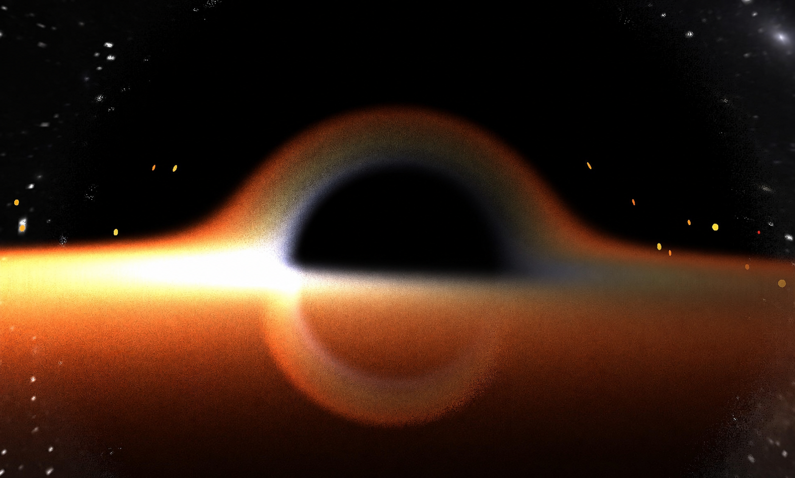
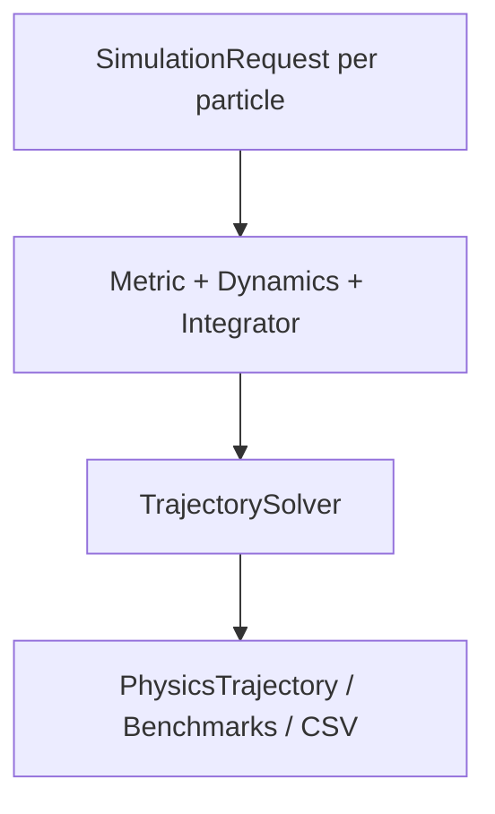
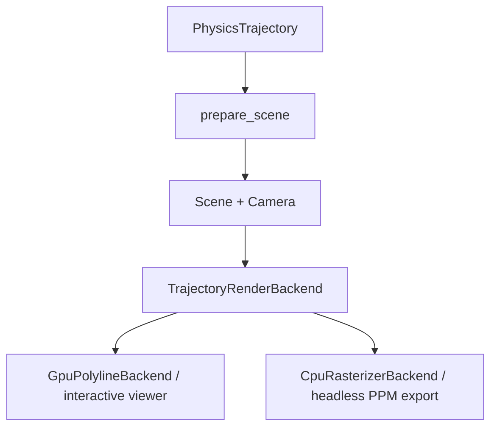
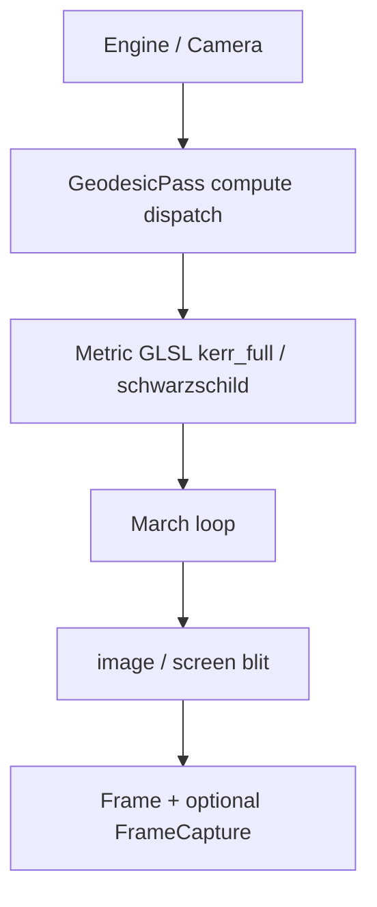

# Penrose

**A General Relativity framework for simulating, analyzing, and visualizing particle and photon trajectories in curved spacetime.**

Penrose combines a validated CPU reference solver, scientific benchmarking tools, a modular trajectory visualization pipeline, and a GPU real-time renderer to study particle and photon motion in curved spacetime.

---

# Gallery

## Real-Time Kerr Rendering



*(GPU compute ray march — default metric in `realtime/` is Kerr via `kerr_full.glsl`.)*

## Null Geodesic Evolution


---

## Physics

Penrose evolves **timelike** and **null geodesics** by numerically integrating the geodesic equation on spacetime metrics.

$$\frac{d^2x^\mu}{d\tau^2}+\Gamma^\mu_{\alpha\beta}\frac{dx^\alpha}{d\tau}\frac{dx^\beta}{d\tau}=0$$

The simulation engine separates spacetime geometry, equations of motion, numerical integration, data storage, and visualization, allowing physical models and rendering systems to evolve independently.

---

## Current Capabilities

### Physics (CPU)

* Schwarzschild and Kerr spacetimes (CPU production paths)
* Timelike and null geodesic evolution
* Analytical Christoffel symbols
* RK4 geodesic integration
* Configurable termination policies
* Extensible `Spacetime::Metric` interface (`SimulationRequest::metric` variant)

### Scientific Analysis

* Reference CPU implementation
* Validation benchmark suite (Schwarzschild or Kerr CSVs)
* Conserved quantity monitoring
* Integration convergence studies
* CSV trajectory export
* Python-based analysis and figure generation (`physics/analysis/`)

### Trajectory Visualization

A modular visualization pipeline decoupled from the physics engine.

* Interactive GPU trajectory viewer (Kerr bound orbit by default in `run/viewer`)
* Headless CPU rasterization and image export (same Kerr default in `run/export`)
* Opaque horizon disc, soft glow, and optional photon-sphere ring (GPU two-pass / matching CPU paint)
* Multiple simultaneous trajectories
* Resolution-independent rendering pipeline
* Animation sequence generation

### Real-Time Rendering

An independent GPU renderer for interactive exploration of relativistic optics.

* Real-time **Kerr** compute-shader ray marching (default); Schwarzschild full/reduced paths available via shader includes
* OpenGL 4.3 / GLSL 430
* Interactive camera controls
* Frame capture and image export
* High-performance gravitational lensing visualization

---

# Architecture

Penrose consists of three complementary pipelines.

## 1. Scientific Physics Pipeline (CPU)

Reference implementation responsible for correctness.



---

## 2. Trajectory Visualization

Consumes stored trajectories; never constructs metrics or solvers.



Stage 2 (`prepare_scene`) is currently a pass-through; interpolation is reserved.

Presentation effects are purely visual and never influence the underlying simulation. The interactive viewer and the `realtime/` ray marcher are independent OpenGL apps.

---

## 3. GPU Real-Time Rendering

Interactive visualization via compute-shader geodesic march (Kerr by default).



The CPU physics pipeline remains the scientific reference implementation.

The GPU ray-march renderer is optimized for interactive lensing exploration and does not share the CPU metric implementation.

Current architecture reference: [`docs/ARCHITECTURE.md`](docs/ARCHITECTURE.md).

---

# Quick Start

## Build

```bash
git clone https://github.com/microsoft/vcpkg.git ~/vcpkg
~/vcpkg/bootstrap-vcpkg.sh

cmake -B build -S . \
  -DCMAKE_TOOLCHAIN_FILE=$HOME/vcpkg/scripts/buildsystems/vcpkg.cmake

cmake --build build
```

---

## Run

Trajectory visualization uses **config-driven executables**. Edit the matching `run/*/main.cpp`, rebuild, and run — no CSV paths or CLI flags required for viewer/export.

| Goal | Edit | Command |
|------|------|---------|
| GPU ray-march renderer (Kerr default) | `realtime/shaders/reduced.comp` to swap metrics | `./build/Penrose` |
| Physics benchmarks (Kerr default) | `run/benchmark/main.cpp` | `./build/physics_benchmark` |
| Interactive trajectory viewer (GPU, Kerr default) | `run/viewer/main.cpp` | `./build/visualization_viewer` |
| Export still / sequence (CPU, Kerr default) | `run/export/main.cpp` | `./build/visualization_export` |

```bash
# Example: change initial conditions in run/viewer/main.cpp, then
cmake --build build --target visualization_viewer
./build/visualization_viewer
```

Complete walkthrough: [`docs/VISUALIZATION_GUIDE.md`](docs/VISUALIZATION_GUIDE.md) · Architecture: [`docs/ARCHITECTURE.md`](docs/ARCHITECTURE.md) · Run guide: [`docs/RUNNING.md`](docs/RUNNING.md)

---

# Documentation

| Document | Description |
|----------|-------------|
| [`docs/ARCHITECTURE.md`](docs/ARCHITECTURE.md) | Current architecture (sole reference) |
| [`docs/VISUALIZATION_GUIDE.md`](docs/VISUALIZATION_GUIDE.md) | Trajectory viz three-executable UX |
| [`docs/RUNNING.md`](docs/RUNNING.md) | Install / run all pipelines |
| [`AGENTS.md`](AGENTS.md) | Conventions for AI / contributor agents |

---

# Roadmap

Penrose is evolving toward a general relativistic simulation framework.

Near-term:

- Realtime `MetricType` + runtime Kerr parameters from C++ (replace hardcoded GLSL constants)
- Align realtime metric identity with `shared/` vocabulary

Planned capabilities include

- Solar Gravitational Lensing
- Numerical metrics
- Coupled multi-body dynamics (independent multi-particle overlay already supported)
- Photon bundles / ray ensembles
- Spline / adaptive visualization resampling
- Relativistic optical systems
- GPU post-process parity with CPU export (bloom / cosmetic lensing)

---

# Current Status

Penrose currently provides:

- validated CPU **Schwarzschild** and **Kerr** physics with scientific benchmarking and Python analysis
- three-stage trajectory visualization with dual Stage 3 backends (GPU viewer / CPU export)
- GPU real-time compute ray-march rendering with **Kerr as the default** shader metric

Development continues toward fuller shared-vocabulary alignment between CPU and GPU pipelines.

---
