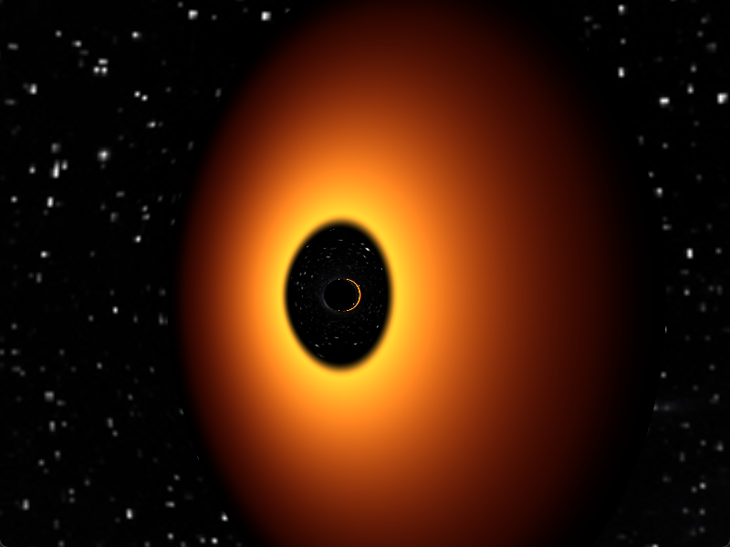
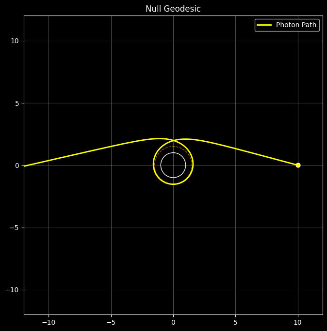
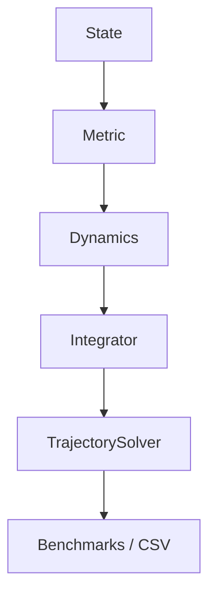
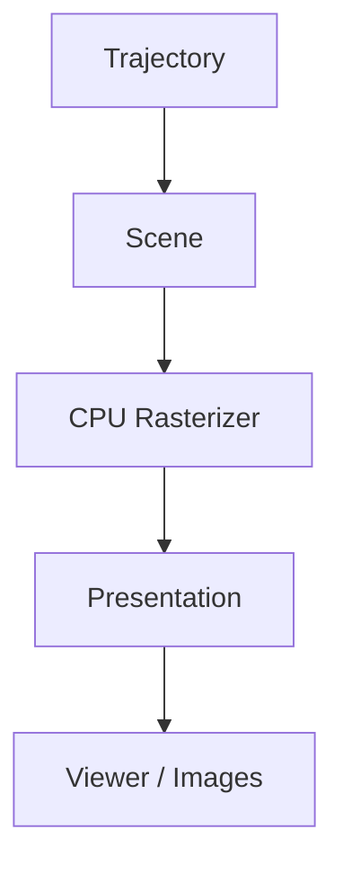
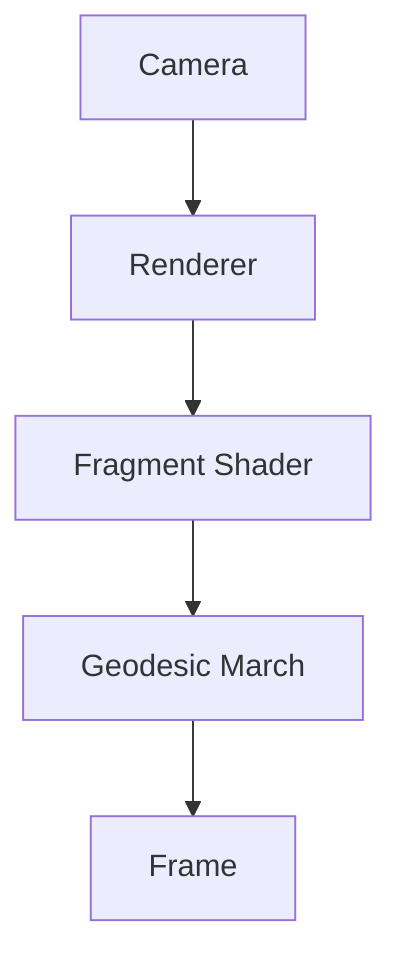

# Penrose

**Penrose is a modular General Relativity framework for simulating, analyzing, and visualizing particle and photon trajectories in curved spacetime.**

Built around a physics-first architecture, Penrose combines a validated CPU reference solver, scientific analysis tools, a CPU trajectory visualization engine, and a GPU real-time renderer into a unified framework for studying relativistic motion.

Originally developed for Schwarzschild black holes, the long-term goal is a general framework supporting arbitrary spacetime metrics, gravitational lensing, and relativistic optical systems such as the Solar Gravitational Lens (SGL).

---

## Physics

Penrose evolves **timelike** and **null geodesics** by numerically integrating the geodesic equation

$$\frac{d^2x^\mu}{d\tau^2}+\Gamma^\mu_{\alpha\beta}\frac{dx^\alpha}{d\tau}\frac{dx^\beta}{d\tau}=0\$$

using a modular spacetime abstraction.

The framework separates:

- spacetime geometry
- equations of motion
- numerical integration
- trajectory evolution
- visualization

allowing new metrics to be introduced without modifying the core simulation pipeline.

---

# Gallery

## Real-Time Schwarzschild Rendering




## Null Geodesic Evolution




---


# Capabilities

Penrose contains a complete scientific benchmarking pipeline.

Current validation scenarios include

- Stable bound orbits
- Radial freefall
- Null geodesic scattering
- Critical photon trajectories
- Integration convergence studies
- Conserved quantity monitoring

Outputs include

- CSV trajectory data
- Benchmark metrics
- Validation reports
- Publication-quality scientific figures
- Interactive visualization
- GPU real-time rendering

---

# Features

## Physics

- Schwarzschild metric implementation
- Modular spacetime interface
- Timelike and null geodesics
- Analytical Christoffel symbols
- RK4 geodesic integration
- Configurable termination policies
- Extensible metric architecture

## Scientific Computing

- Reference scientific implementation
- Scientific benchmark suite
- Automatic validation metrics
- CSV trajectory export
- Python analysis pipeline
- Deterministic simulations

## Visualization

### CPU Trajectory Visualization

- Scientific trajectory renderer
- Interactive orbit viewer
- Multiple simultaneous trajectories
- Presentation-oriented rendering
- Headless image export
- PPM animation sequences

### GPU Real-Time Renderer

- Interactive Schwarzschild renderer
- OpenGL + GLSL
- Real-time camera controls
- High-performance visualization

---

# Architecture

Penrose consists of three complementary pipelines.

## 1. Scientific Physics Pipeline (CPU)

Reference implementation responsible for correctness.



---

## 2. CPU Trajectory Visualization

Consumes immutable trajectories generated by the physics pipeline.



Presentation effects are purely visual and never influence the underlying simulation.

---

## 3. GPU Real-Time Rendering

Interactive visualization of Schwarzschild spacetime.



The CPU physics pipeline remains the scientific reference implementation.

The GPU renderer is optimized for interactive exploration.

---

# Repository Structure

```
penrose/
├── physics/              # CPU reference solver
│   ├── metrics/          # Spacetime geometry (Schwarzschild)
│   ├── geodesics/        # Equations of motion
│   ├── integrators/      # RK4 integration
│   ├── simulation/       # Trajectory solver
│   ├── validation/       # Benchmark suite
│   └── analysis/         # Python notebooks & plots
├── visualization/        # CPU trajectory renderer
│   ├── Apps/             # Viewer, export, benchmark binaries
│   ├── Renderer/         # Rasterization pipeline
│   └── Scene/            # Scene composition
├── realtime/             # GPU interactive renderer
│   ├── renderer/         # OpenGL engine
│   ├── shaders/          # GLSL geodesic marching
│   └── resources/        # Textures & assets
├── shared/               # Common math & utilities
├── docs/                 # Architecture & usage guides
├── outputs/              # Generated benchmarks & renders
├── examples/             # Example workflows
├── vendor/               # Eigen, stb (header-only)
├── CMakeLists.txt
├── vcpkg.json
└── requirements.txt      # Python analysis deps
```

---

# Quick Start

## Build

```bash
git clone https://github.com/microsoft/vcpkg.git ~/vcpkg
~/vcpkg/bootstrap-vcpkg.sh

cmake -B build -S . \
-DCMAKE_TOOLCHAIN_FILE=$HOME/vcpkg/scripts/buildsystems/vcpkg.cmake

cmake --build build
```

---

## Run

| Goal | Command |
|-------|---------|
| GPU renderer | `./build/Penrose` |
| Generate benchmarks | `./build/benchmark_test` |
| Interactive CPU viewer | `./build/visualization_viewer --csv outputs/.../orbital.csv` |
| Export still | `./build/visualization_export --csv outputs/.../orbital.csv` |
| Run visualization tests | `./build/visualization_test` |

Complete walkthrough:

`docs/frame_capture/RUNNING.md`
`docs/frame_capture/VISUALIZATION_GUIDE.md`

---

# Outputs

Benchmark runs generate timestamped outputs

```text
outputs/

benchmark_data/
validation_figures/
rendered_frames/
```

including

- trajectory CSVs
- benchmark metrics
- validation reports
- publication figures
- rendered images

---

# Documentation

| Document | Description |
|-----------|-------------|
| visualization/README.md | CPU visualization architecture |
| docs/RUNNING.md | GPU renderer |
| docs/frame_capture/VISUALIZATION_GUIDE.md | CPU visualization workflow |
| docs/architecture/ | Design documentation |

---

# Roadmap

Penrose is evolving toward a general relativistic simulation framework.

Planned capabilities include

- Solar Gravitational Lensing
- Kerr spacetime
- Numerical metrics
- Multi-particle simulations
- Photon bundles
- Relativistic optical systems
- Scientific analysis tools
- Additional visualization backends

---

# Current Status

Penrose currently provides a complete Schwarzschild simulation framework consisting of

- validated CPU physics
- scientific benchmarking
- trajectory visualization
- GPU real-time rendering

Development is now focused on generalized spacetime support and expanding Penrose beyond Schwarzschild into a modular General Relativity research framework.
